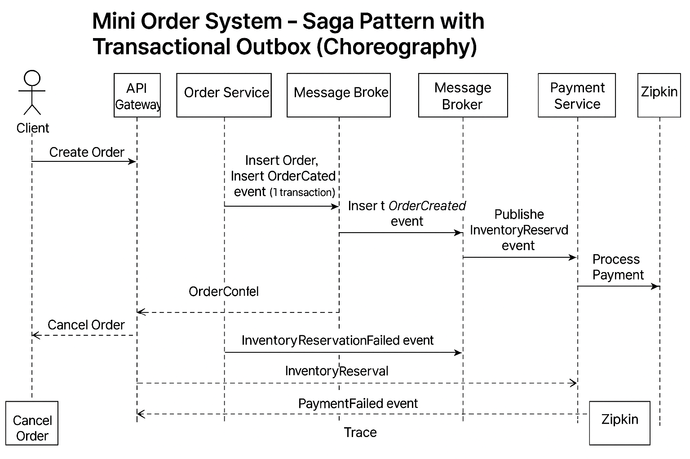

dous communication.

Zipkin: Distributed tracing to monitor service interactions.

MySQL: Database used by Order Service (with Outbox table).

Docker Compose: Manages container orchestration.

🔥 Architecture

📊 Flow Explanation (based on diagram)

Client sends a Create Order request to API Gateway.

Order Service:

Inserts the order into the database.

Inserts an OrderCreated event into the Outbox table (within the same transaction).

An Outbox Poller reads the event and publishes it to Kafka.

Inventory Service consumes the OrderCreated event:

If stock is available, it publishes an InventoryReserved event.

If not, it publishes an InventoryReservationFailed event.

If inventory is reserved successfully, Payment Service processes the payment:

If successful, it publishes a PaymentCompleted event.

If failed, it publishes a PaymentFailed event.

Order Service listens to these events and updates the order status accordingly.

Throughout the process, Zipkin traces the entire flow for observability.

🛠️ Technologies Used

Spring Boot 3

Spring Cloud Stream (Kafka)

Kafka + Zookeeper

MySQL 8

Docker, Docker Compose

Zipkin (Distributed Tracing)

Lombok, MapStruct, Spring Data JPA

📥 How to Run

Build the project

mvn clean package -DskipTests -f order-service/pom.xml

Start the system with Docker Compose

docker-compose up --build

Create an Order

curl -X POST http://localhost:8081/api/orders \
-H "Content-Type: application/json" \
-d '{
      "productId": 1,
      "quantity": 2,
      "price": 100.0
    }'

Access Zipkin

URL: http://localhost:9411

View all traces of order flows.

📄 Services Overview

Service

Port

Purpose

API Gateway

8080

Route requests from clients

Order Service

8081

Manage orders, emit Kafka events

Inventory Service

8082

Manage inventory checking

Payment Service

8083

Process payments

Zipkin

9411

Trace monitoring

Kafka

9092

Event messaging broker

🔧 Project Structure

microservices-saga-kafka/
├── docker-compose.yml
├── order-service/
│   ├── src/
│   ├── Dockerfile
│   └── pom.xml
├── inventory-service/ (not yet implemented)
├── payment-service/ (not yet implemented)
└── README.md

✨ Future Improvements

Complete Inventory Service and Payment Service implementations.

Add Cancel Order feature with compensating events.

Introduce Retry and Dead Letter Queue (DLQ) mechanisms.

Integrate Authorization with Keycloak.

🚀 Conclusion

This project provides hands-on experience with:

Distributed transactions via Saga Pattern (Choreography)

Event-Driven Architecture using Kafka

Reliable Event Publishing with Outbox Pattern

Distributed Tracing using Zipkin

Dockerizing Microservices Architecture

Happy coding! 🎉

